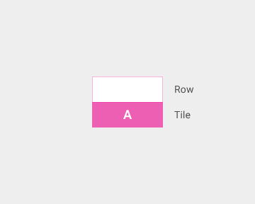
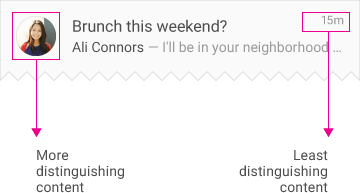
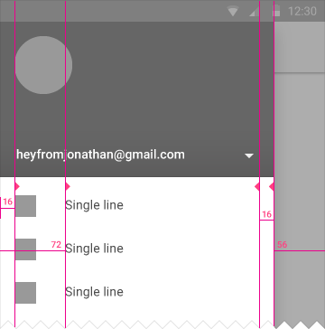
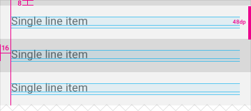
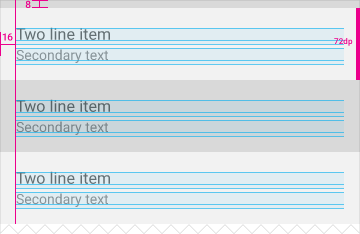
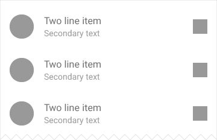
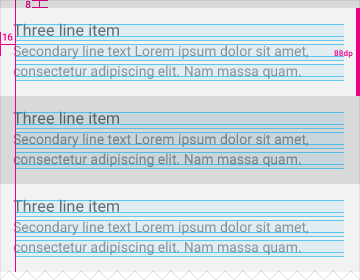
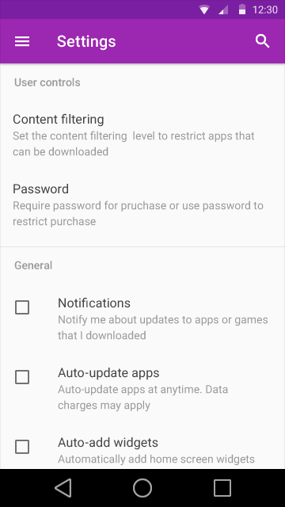

列表作为一个单一的连续元素来以垂直排列的方式显示多行条目。

> **目录**

> [用法](#lists_usage)

> [内容](#lists_content)

> [行为](#lists_behavior)

> [边框](#lists_keylines)

<h3 id="lists_usage">用法</h3>

**列表**由单一连续的列构成，该列又等分成相同宽度称为**行(rows)** 的子部分。行是**瓦片(tiles)** 的容器。

瓦片中存放内容，并且在列表中可以改变高度。

列表最适合应用于显示**同类的数据类型或者数据类型组（homogeneous data type or sets of data types）**，比如图片和文本，同时列表也是最佳的阅读理解优化方案。这种阅读理解带有数据类型之间的区别的目的，或者在单一数据类型中的特性。

如果有超过三行的文本需要在列表中显示，换用卡片（cards）代替。

如果内容的主要区别来源于图片，换用网格列表（grid list）。

----------

<h3 id="lists_content">内容</h3>

**文本内容**

列表瓦片以一致的格式来显示一组相关的内容，采取层次感优于一致性类型或者一组内容的方式来增强阅读感。比如，在时间戳上强调头像和文本片段。这有助于使用者可以在一组内容中更容易地区分出他们要找的信息。

列表瓦片可以包含三行的文本，并且文本的字数可以在同一列表的不同瓦片间改变。要显示多于三行的文本，使用卡片。

与瓦片的左侧和多行内容中的瓦片内的第一行相比较，更偏向于瓦片中的有明显区别的内容。

**文本动作**

列表瓦片中空间大部分应用专用于主要的动作。

因为动作是列表瓦片中不能识别的元素，所以将额外的动作放置在瓦片的右边。

主要动作和额外动作，比如播放、放大、删除和选择，是瞬时性的，并且通常不会在列表中弹出选项子菜单（动作溢出列表， action overflow）。

动作可以打开一个随后的视图，如卡片或者悬浮卡片（hovercard）。

**主要动作**

- 充满整个瓦片，因此不能通过图标、文本等元素呈现。
- 在特定的列表中所有瓦片的动作是一致的。比如在指定的音乐列表中，瓦片的主要内容是播放一首歌曲，或者在邮件列表中是打开一封邮件来阅读。

**额外动作**

- 在瓦片中通过图标、次要文本等来呈现出来。
- 在指定的列表中所有瓦片的动作是功能一致的，比如图片标识某人某人是否在线等。
- 在指定列表的瓦片中，动作放置的位置是一致的。

避免不断在瓦片中使用额外动作来制造“噪声”，比如在每个瓦片中显示分享动作按钮。触发按钮，比如星标（starts）或者置顶（pins）是一个特例，因为它们通过显示状态来呈现出有效的信息。

----------

<h3 id="lists_behavior">行为</h3>

**滚动**

列表只支持垂直滚动。

**手势**

在列表中，每个瓦片的猛击（swipe）动作应当是一致的。

在操作正确时，瓦片可以在列表和下拉目标间移动（比如，移动一个文件到文件夹）。

在操作正确时，瓦片可以被选中并且在列表中可以手动改变顺序。

**文本过滤与排序**

列表瓦片可以通过数据、文件大小、字母顺序或者其它参数来编程改变其顺序或者实现过滤。

要(Do)

不要（Don't）

----------

<h3 id="lists_keylines">边框</h3>

在**单行列表**中，每个瓦片包含了单行的文本。文本字数可以在同一列表的不同瓦片间改变。

元素

内容

在**两行列表**中，每个瓦片最多包含两行的文本。文本字数可以在同一列表的不同瓦片间改变。

元素

内容

在三行列表中，每个瓦片最多包含三行文本。

文本的字数可以在同一列表的不同瓦片间改变。

元素

内容

**单行列表**

**仅有文本**

字体： Roboto Regular 16sp

瓦片高： 48dp

文本内边距： 16dp

在列表的上部和下部添加8dp的内边距。一个特例是在带有表头条目（subheader）的列表上部，因为表头条目包含了它们自己的内边距。

元素

元素

内容

**带有文本的图标**

字体： Roboto Regular 16sp

瓦片高： 48dp

左边图标内边距： 16dp

文本左内边距： 72dp

文本上部和下部内边距： 16dp

在列表的上部和下部添加8dp的内边距。一个特例是在带有表头条目（subheader）的列表上部，因为表头条目包含了它们自己的内边距。

元素

元素

内容

**带有文本的头像**

字体： Roboto Regular 16sp

瓦片高： 56dp

左边头像内边距： 16dp

文本左内边距： 72dp

文本上部和下部内边距： 20dp

在列表的上部和下部添加8dp的内边距。一个特例是在带有表头条目（subheader）的列表上部，因为表头条目包含了它们自己的内边距。

元素

元素

内容

**两行列表**

**仅有文本**

主要文本的字体： Roboto Regular 16sp

次要文本的字体： Roboto Regular 14sp

瓦片高： 72dp

文本内边距： 16dp

在列表的上部和下部添加8dp的内边距。一个特例是在带有表头条目（subheader）的列表上部，因为表头条目包含了它们自己的内边距。

元素

元素

内容

**带有文本的头像**

主要文本的字体： Roboto Regular 16sp

次要文本的字体： Roboto Regular 14sp

瓦片高： 72dp

左边头像内边距： 16dp

文本左内边距： 72dp

文本上部和下部内边距： 16dp

图标和文本区域中心对齐。

在列表的上部和下部添加8dp的内边距。一个特例是在带有表头条目（subheader）的列表上部，因为表头条目包含了它们自己的内边距。

元素

元素

内容

**带有文本和图标的头像**

主要文本的字体： Roboto Regular 16sp

次要文本的字体： Roboto Regular 14sp

瓦片高： 72dp

左边头像内边距： 16dp

文本左内边距： 72dp

文本上部和下部内边距： 16dp

右边图标内边距： 16dp

在列表的上部和下部添加8dp的内边距。一个特例是在带有表头条目（subheader）的列表上部，因为表头条目包含了它们自己的内边距。

元素

元素

内容

**三行列表**

**仅有文本**

主要文本的字体： Roboto Regular 16sp

次要文本的字体： Roboto Regular 14sp

瓦片高： 88dp

文本内边距： 16dp

在列表的上部和下部添加8dp的内边距。一个特例是在带有表头条目（subheader）的列表上部，因为表头条目包含了它们自己的内边距。

元素

元素

内容

**带有文本的头像**

主要文本的字体： Roboto Regular 16sp

次要文本的字体： Roboto Regular 14sp

瓦片高： 88dp

左边头像内边距： 16dp

文本左内边距： 72dp

文本上部和下部内边距： 16dp

头像和主要文本上部对齐。

在列表的上部和下部添加8dp的内边距。一个特例是在带有表头条目（subheader）的列表上部，因为表头条目包含了它们自己的内边距。

元素

元素

内容

**带有文本和图标的头像**

主要文本的字体： Roboto Regular 16sp

次要文本的字体： Roboto Regular 14sp

瓦片高： 88dp

左边头像内边距： 16dp

文本左内边距： 72dp

文本上部和下部内边距： 16dp

右边图标内边距： 16dp

头像和图标与主要文本上部对齐。

在列表的上部和下部添加8dp的内边距。一个特例是在带有表头条目（subheader）的列表上部，因为表头条目包含了它们自己的内边距。

元素

元素

内容