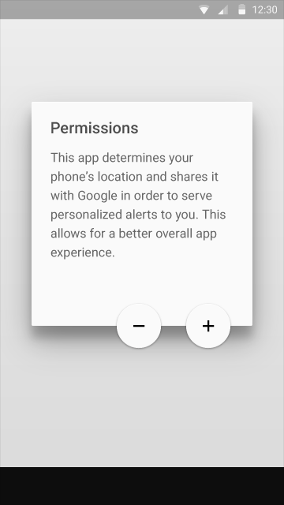
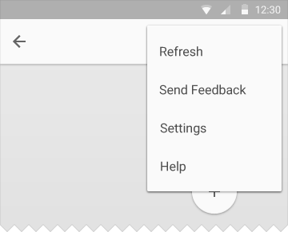
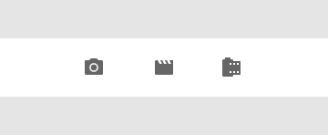
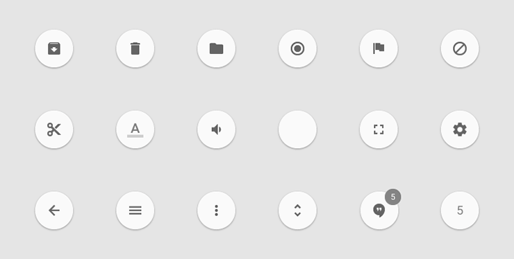
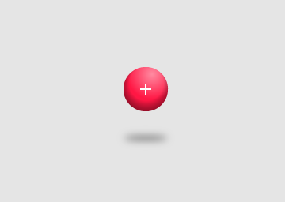
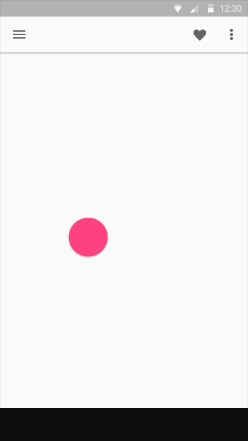
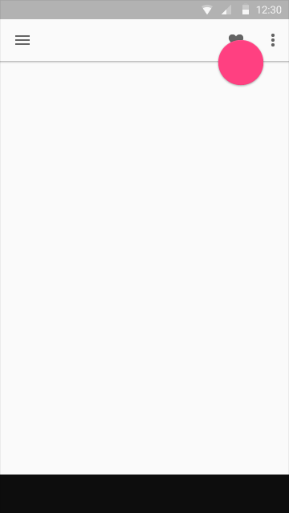
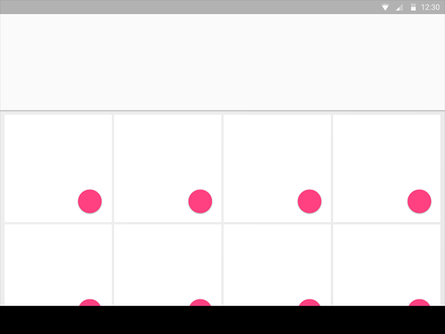
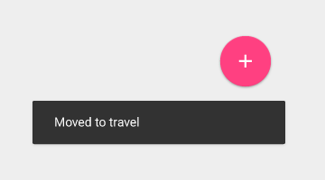

#模式
##促进的动作
###浮动按钮
浮动按钮是一个促进动作的一个特殊案例。它像一个圆形的标识浮在所有界面之上，并且在改变、启动、转换锚点时有特殊的动作，这使浮动按钮与其他的按钮相区别。  
有两种大小的浮动按钮：默认大小和迷你版的。迷你版的浮动按钮只应该在需要和屏幕上的其他元素产生视觉上的延续性时使用。   
&nbsp;
&nbsp;
&nbsp;
&nbsp;

####相关内容
不是每个页面都需要一个浮动按钮。浮动按钮应该代表一个应用里最主要的功能。在左边的页面里，最主要的功能是滑动浏览和打开图库里的图片，所以这里不需要浮动按钮。而在右边的页面里，最主要的功能是添加文件。在这里，放置一个浮动按钮是合适的。  

 
正确     

 
正确          
尽量一个页面只用一个浮动按钮，毕竟它是整个页面最突出的按钮。   

 
错误      

 
错误             
不要在对话框里用浮动按钮。用扁平的按钮即可。      

 
正确       

 
错误                
不要把浮动按钮连接到侧边抽屉里，它会干扰一个本想完成特定任务的用户。侧边抽屉是导航用的。     

 
正确       

 
错误          
不要把浮动按钮和下拉菜单联系到一起。    

 
正确        

 
错误           

####相关动作
把多出来的操作放在工具栏的“溢出（overflow）”菜单里面，而非浮动按钮里面。   

 
正确      

 
正确            

 
错误    

 
错误          
如果一个应用的特点是添加文件种类，那么浮动按钮在首次点击后可以变成相关的几个按钮。       

 
正确          

 
正确      
当然，如果浮动按钮点击后出现的动作选项与浮动按钮无关且不是浮动按钮的自然的延伸，那么这些动作选项也许应该放到“溢出”菜单里面。    

 
错误               

 
错误            
如果一个浮动按钮变成一个工具条，那么这个工具条应该包含的是相关的选项。在这个例子里，浮动按钮让用户选择添加的媒体类型。    

 
正确                

 
正确            
不要将浮动按钮变成一个包含不相干或干扰的选项的工具条。   

 
错误                 

 
错误                   
一个浮动按钮可以包含一列联系人。   

 
正确           

 
正确              
但它不应包含不相干的选项。    

 
错误              

 
错误                  

####特质
让浮动按钮做一些像创建、加入我的最爱、分享、导航和探索这样的积极的动作。   

 
正确      
通常情况下，避免用浮动按钮做一些消极的动作，比如档案或垃圾桶；没有细化的动作；警告或错误；剪切文字这样的受限制的任务；或是应该在工具栏里出现的控件，比如声音控制或是改变字体颜色。浮动按钮不应包含应用栏（译者注：工具栏、状态栏之类）上的标识或是状态栏上的信息，比如通知。不要在浮动按钮上加一层徽章或是其他元素。    

 
错误    
为了不让用户困惑，始终使用圆形的按钮。    

 
正确                 

 
错误               
不要让浮动按钮跳起来。    

 
正确             

 
错误              

####放置位置
一个浮动按钮可以根据图框间距的规则或是附在一个延伸的应用栏（译者注：工具栏、状态栏之类）上来放置。    

 
正确         

 
正确              
浮动按钮可以附在页脚或是延伸的薄片（sheet）上。   

 
正确            

 
正确           
浮动按钮不应浮动在一个随机的位置。在把浮动按钮附在工具栏上时要注意，它可能会和其他点击目标重叠或覆盖。   

 
错误             

 
错误                    
浮动按钮可以附在一个延伸的页头上。   

 
正确                   
浮动按钮可以附在工具栏或一个页面里结构化的元素上（只要不盖住其他元素）。   

 
正确                  
浮动按钮可以附在一张薄片（sheet）的边缘上。   

 
正确                     
一个页面不要出现多个浮动按钮。    

 
错误                  
不要吧浮动按钮附在或放进抽屉。   

 
错误                  
不要把浮动按钮和页面上的每个元素联系起来。   

 
错误                  
不要用零食条和吐司（snackbars or toasts）把浮动按钮挡住。   

  
正确                    

  
错误                  

