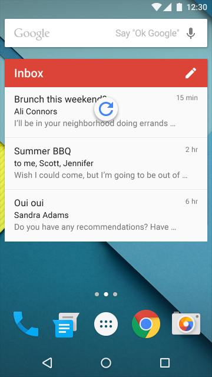

   ---
layout: page
title: 滑动刷新
permalink: swipe-to-refresh.html
---

# Swipe to refresh
# 滑动刷新

## Updating content
## 更新内容

There are two methods for updating content in an app. The preferred method is to automatically update content using [sync](http://developer.android.com/training/sync-adapters/index.html). Syncing keeps app content automatically updated because it doesn’t require user action.

在应用里有两种更新内容的方法。较好的方法是用[sync](http://developer.android.com/training/sync-adapters/index.html)自动更新内容。Syncing能保持内容自动更新，因为它不需要用户操作。

Alternatively, the manual refresh method requires users to initiate content updates via an action or gesture. Manual refreshing can supplement syncing while maintaining a current scroll position, as when checking for new mail in a Gmail account.

另外一种，手动刷新需要用户通过动作或者手势启动内容更新。手动刷新能增加同步，同时保持当前的滚动位置。例如在Gmail里检查新邮件。

## Swipe to refresh
## 滑动刷新

Swipe to refresh is a [swipe gesture](http://www.google.com/design/spec/patterns/gestures.html#gestures-gestures) available at the beginning of lists, grid lists, and card collections where the most recent content appears (Index 0).

滑动更新是一个滑动手势。可用在普通列表，方格列表的开始处和卡片集合的最近内容出现的位置（Index 0）。

Location:
位置：

Typically, this gesture is available at the top of content collections, but it can also be at the bottom (for example, in chat applications).

典型的，手势在内容集合的顶部使用。但是它也可以在底部使用（例如，在聊天应用）。

Usage:
用法：

The refresh indicator appears only in conjunction with a refresh gesture or action. Syncing does not display a refresh indicator. It’s best to use this gesture with dynamic content that has frequent updates surfacing from a consistent location, where users have a high probability of seeing new content after initiating the gesture.

滑动图标仅仅与刷新手势或者动作一起出现。Syncing不显示刷新图标。手势最好用在固定界面频繁更新的动态内容上。固定界面是用户开始手势后新内容最可能显示的地方。

Changes may not be immediately obvious to users when this gesture is used in views that can change significantly upon refresh. For example, the refresh may non-sequentially delete, reorder, modify, and insert items or change only off-screen items.

> [Swipe to refresh layout](https://developer.android.com/reference/android/support/v4/widget/SwipeRefreshLayout.html)  
> [滑动刷新布局]
> Refresh the contents of a view via a vertical swipe gesture
> 通过一个垂直方向的滑动手势刷新视图的内容。
**add video**  
Animation showing swipe to refresh
动画显示滑动刷新

Swipe to refresh should not be used in the following situations:
滑动刷新不应该用在以下的情景：
* Navigation drawers
* Home screen widgets
* Pannable content

* 抽屉式的导航栏
* 主屏幕插件
* Pannable文本

不宜  
Navigation drawers (if present in an app) contain navigation destinations, not dynamic content.
抽屉式导航栏（如果在应用中存在）包括导航选项，不是动态内容。

不宜
Home screen widgets should update content automatically.
主屏幕插件应该阻挡更新内容。

不宜   
Pannable content, like in maps, have no primary direction or content origin from which users can presume the swipe to refresh gesture will originate.
Pannable内容，像地图，没有一个主要的方向或者内容起点，用户能认做滑动刷新的起点。

### Refresh indicator positioning and behavior
### 刷新图标位置和行为

Position:
位置：

The refresh indicator, when resting, is centered horizontally relative to refreshing content.
刷新图标，当滑下来时，在刷新内容的垂直正中间位置。

适合

不适合   

不适合

The refresh indicator is located near the top of refreshing content.
刷新图标位置靠近刷新内容的顶部

Its exact vertical resting position can be adjusted to promote visual harmony with the underlying layout. For example, the indicator may fall on a material edge or grid line, as long as it’s located near the top of the refreshing content.

  
适合

不适合

Behavior:
行为：

As the refresh indicator translates and/or scales into view, the circular spinner fades in while rotating.

The refresh indicator remains visible until the refresh activity completes and any new content is visible, or the user navigates away from the refreshing content.

**add video**  
适合
Keeping the refresh indicator in view until the activity is completed provides feedback on the status of the refresh activity.

保持刷新图标在视图上直到activity完全提供反馈刷新activity的状态。

**add video**  
不适合
Scrolling the refresh indicator off-screen hides the status of the refresh activity and may imply that the refresh activity is associated with a specific component within the view, such as a card, instead of the entire view.

## Refresh indicator transitions
## 刷新图标过渡

When another surface is positioned in front (in z-space) of the material with refreshing content, the refresh indicator translates from underneath that surface and is clipped until it is fully visible.

The refresh indicator scales up in size as it translates when:

刷新图标

* The refreshing material is in front of every other surface (in z-space)
* A content refresh is initiated via an app bar or overflow menu action

* 刷新材质是在所有其他界面的前面（在z-space）
* 内容刷新开始从app bar或者溢出菜单操作。
**add video**  
Refreshing content that is above every other surface in z-space.   
刷新内容是在所有其他界面之上，在z－space空间。
**add video**   
Refreshing content that is coplanar with another surface.   
刷新内容是
**add video**   
Refreshing content that is below another surface in z-space.   
刷新内容是在z－space里另外的界面之下。
**add video**   
Refreshing content via app bar action.
刷新内容通过app bar操作。

### Implementation details
### 实现细节

To ensure intentional usage of the swipe to refresh gesture, the refresh indicator must pass a threshold before the app will begin to refresh. This threshold is indicated through a number of cues:

确保

* The circular spinner reaches 100% opacity.
* The rotation of the circular spinner slows down.
* The rate of translation of the refresh indicator slows down.

* 圆圈旋转控件100%不透明
* 圆圈控件选择变慢
* 刷新图标的过渡比率变慢

Completing the gesture at any point after passing the threshold will initiate the refresh action.

完全

Reversing the gesture past the threshold will cancel the initiation of the refresh action.

相反的手势到达门槛后将取消刷新操作。

> 原文：[Swipe to refresh](http://www.google.com/design/spec/patterns/swipe-to-refresh.html)  翻译：[awong1900](https://github.com/awong1900)  校对：