# 图标

 - 产品图标
 - 系统图标

##产品图标

产品图标作为一个品牌下的产品、服务和工具的一种视觉表现，能够简洁、显眼且友好地传递产品的核心理念与内涵。尽管每个产品图标看上去截然不同，但对于一个给定品牌，产品图标应通过理念和执行统一起来。

产品图标是传达品牌的一个重要载体。从使用以下准则开始，以确保产品图标的颜色和其他关键要素能够正确反映你的品牌标识。

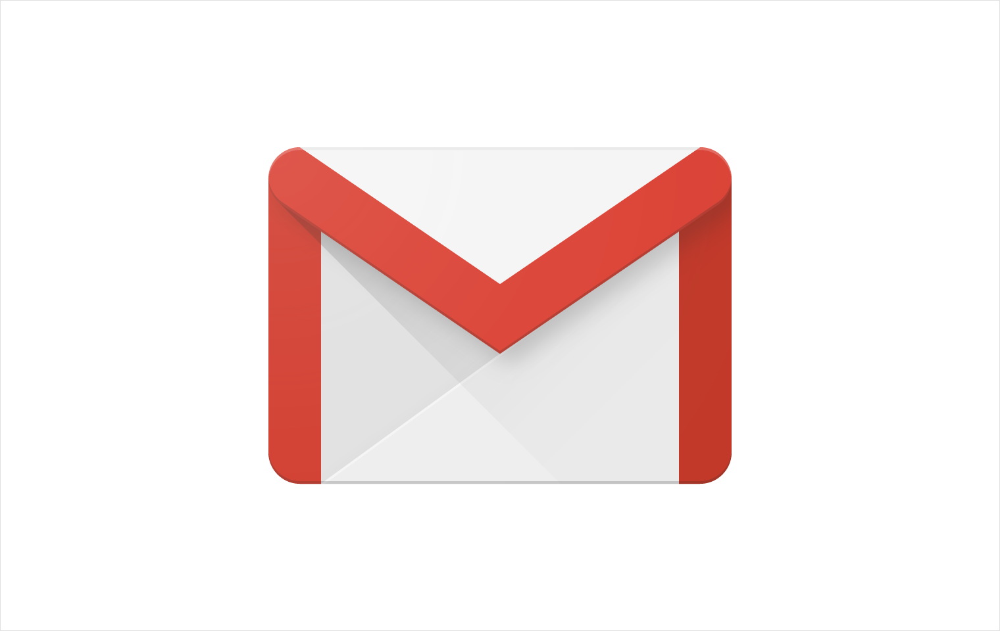

###设计途径

产品图标设计在现实材料质感和触感中获得启发。每个图标都像纸张一样被裁剪、折叠和点燃，却只通过一些简单的图形元素来表现。我们通过整洁的褶皱和清晰的边缘来表现结实坚固的质感，通过微妙的亮点和一致的阴影来展现材料的磨砂抛光。

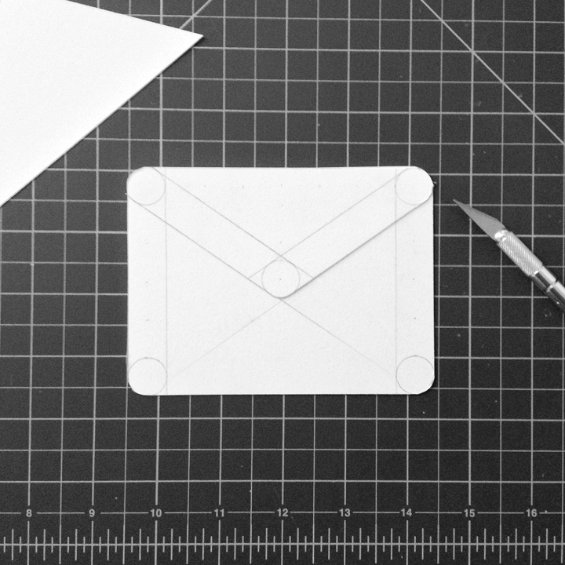

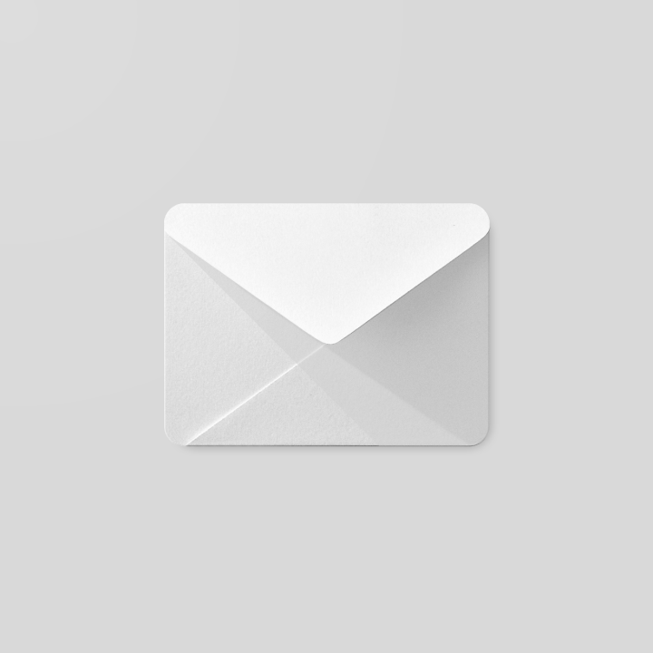

###图标网格

产品图标网格已经发展得便捷的一致，且建立一套明确的图形元素定位规则。这种标准化带来了灵活，且连贯的系统。

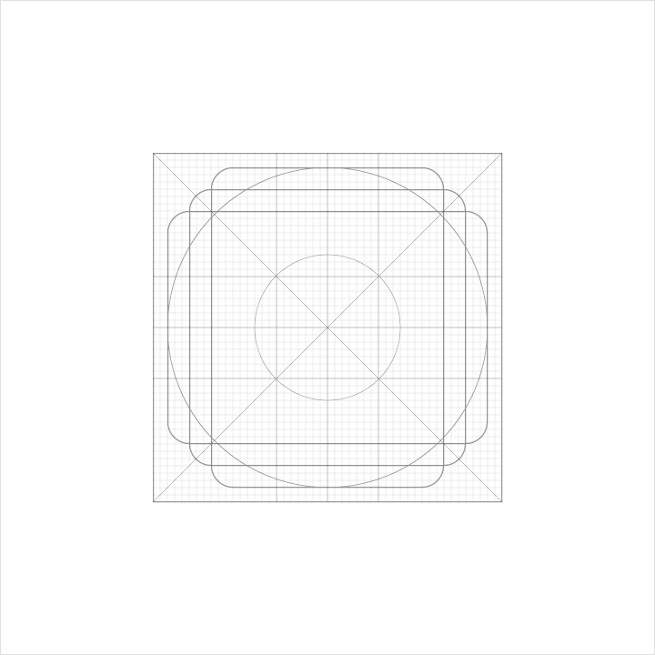
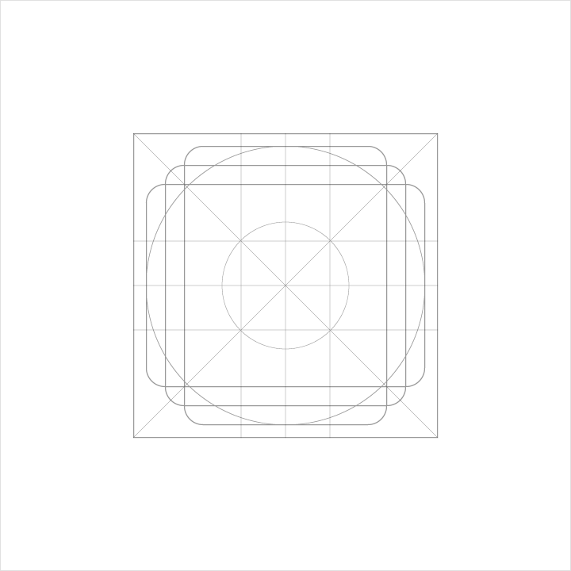

###关键线的形状

关键线的形状是网格的基础。利用这些核心形状做为向导，即可保持整个相关产品的图标一致的视觉比例。

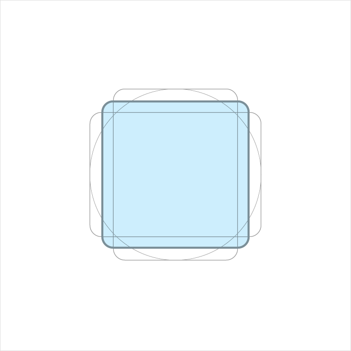
高&宽: 152
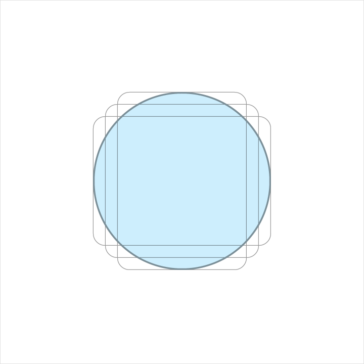
直径: 176
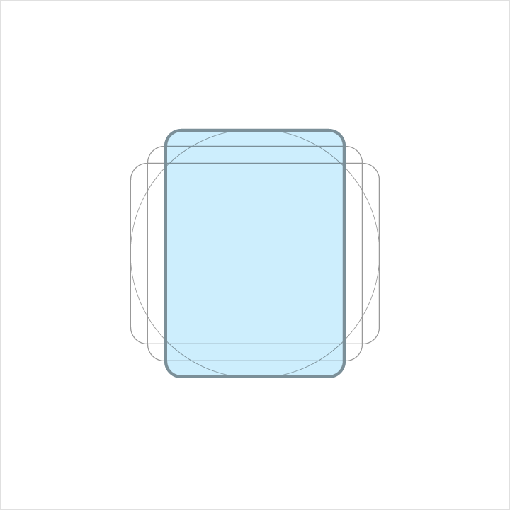
高:176 宽:128
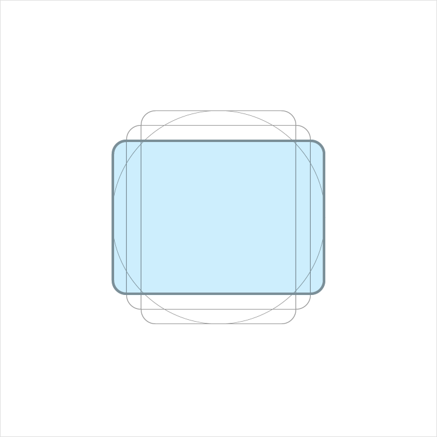
高:128 宽:176

###DP 单位网格

设备的启动器以48dp的尺寸显示产品图标，所以当你创建图标时，请保持48个单位的尺寸，将其放大400%到192 x 192 px。

保持这样的放缩比即可在尺寸在缩小时保持边缘的锋利和对齐的正确性。

###几何

预设规则为几种特定的关键线制定：圆形线、方形线、矩形线、正交线和对角线。这个通用且简洁的元素调板以发展到统一产品图标和规范它们在网格上的布置。

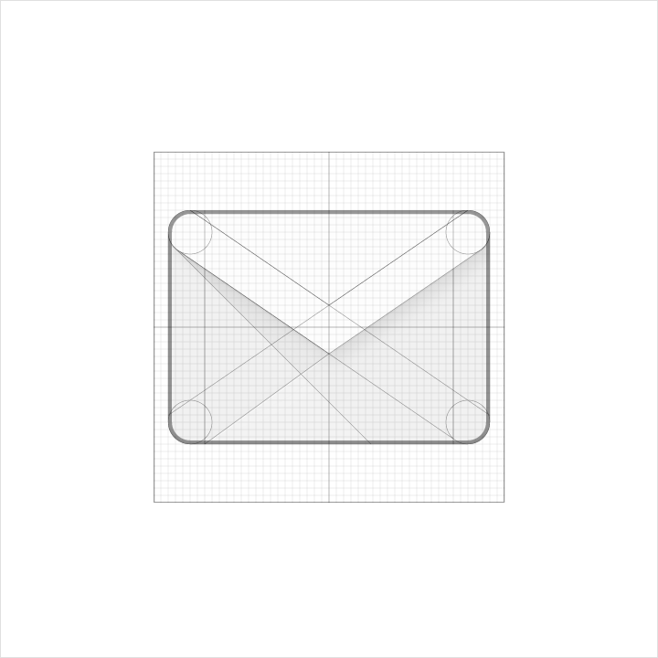

###产品图标剖析

产品图标解剖阐述组成产品图标的图形元素。对于一个给定的品牌，这些图标之间元素的一致性是维护一个共享视觉语言的关键。熟悉这些元素可以更容易地理解每个logo 和它们之间的细微差异的特征。它也将帮助你的眼睛识别的logo 设计的底层结构。

 1. 表层
 2. 材质背景
 3. 材质前景
 4. 色彩
 5. 阴影

每个组件放置在另一个的上面，总能从上方直接看到。
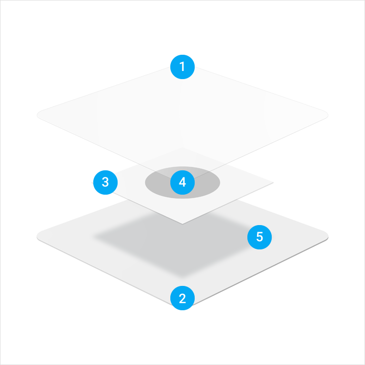
一个展示图标构建时各成分情况的立体分解图。

最里面的材质元素。
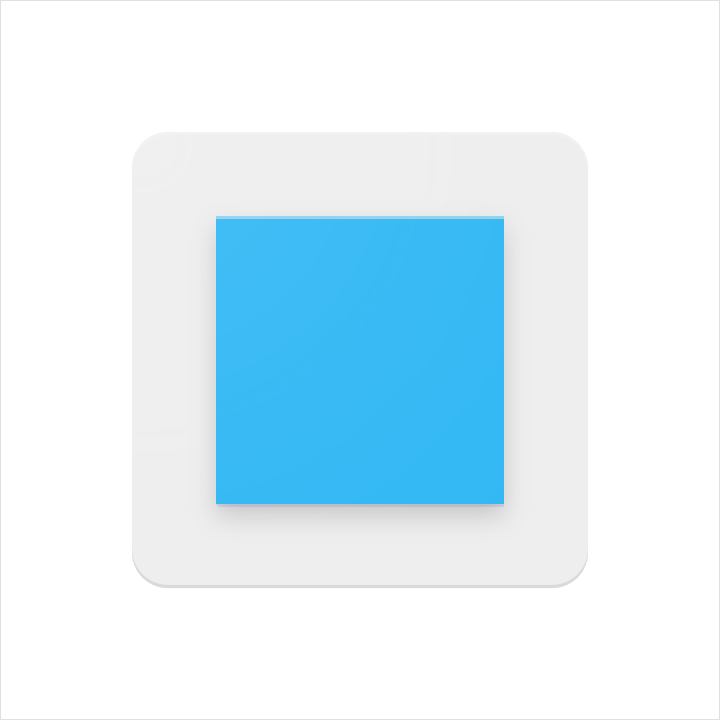
材质前景使一层材质元素凸起并在下方铺上一层阴影。
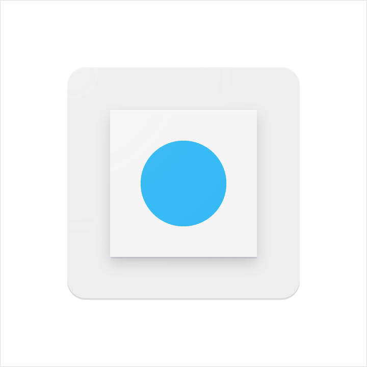
施加到元素一小部分的颜色。

边对边施加到整个元素的颜色。

在一个材质元素的顶部边缘，染上与白色混合的颜色，以减淡了原有的颜色。

在一个材质元素的底部边缘，染上与黑色混合的颜色，以加深了原有的颜色。
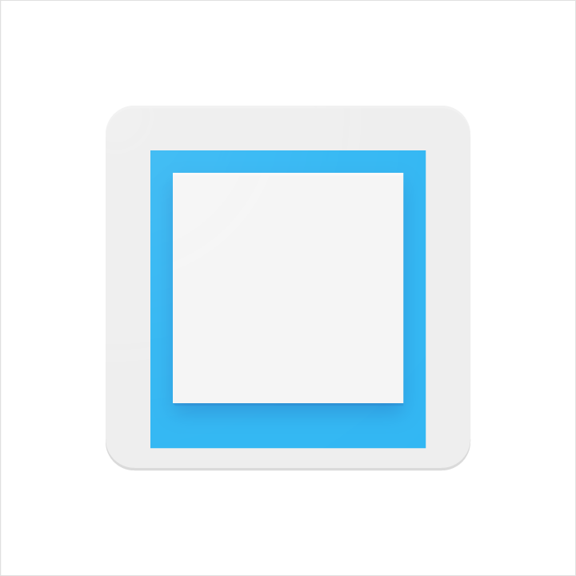
在一个凸起材质元素的四条边上柔和的阴影。
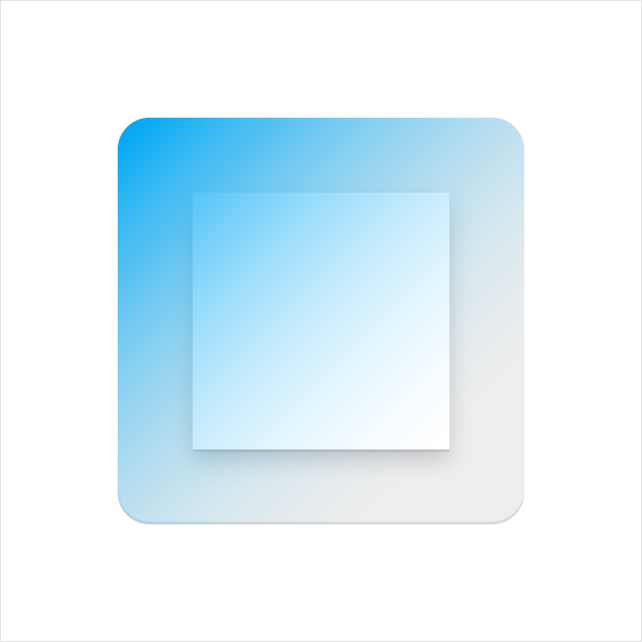
所有元素上提供照明的柔和色彩，自左上到右下渐变。
 
## 系统图标

### 定义

系统图标或者UI界面中的图标代表命令、文件、设备或者目录。系统图标也被用来表示一些常见功能，比如清空垃圾桶、打印或者保存。

系统图标的设计要简洁友好，有潮流感，有时候也可以设计的古怪幽默一点。要把很多含义精简到一个很简化的图标上表达出来，当然要保证在这么小的尺寸下，图标的意义仍然是清晰易懂。  

    

### 设计原则

展示一些黑体的几何形状。

一个简洁的黑体图形在采用对称一致的设计时，一样能够拥有独一无二的品质。

  
  
  
  

### 网格、比例和大小

图标网格是所有图标的基准网格并且具有特定的组成和比例。图标由一些对齐图标网格的平面几何形状组成。基本的平面几何形状有四种，具有特定尺寸以保证所有图标有一致的视觉感和比例。
两种形状相同尺寸不同的图标集供您在应用程序中使用：状态栏、上下文图标集和操作栏、桌面图标集。   

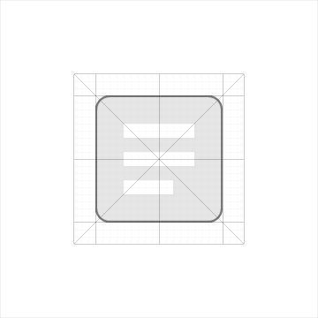   
  
   
   
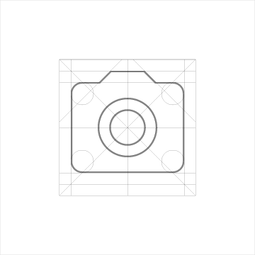   
   

### 圆角

正方形和矩形都应该添加圆角，也可以同时使用圆角和尖角，这样更具凸凹感。所有由笔划或线条组成的图标都有尖角。  

  
   
   
  

每一个尺寸的系统图标集使用不同大小的圆角以保证视觉的一致性。  

  
   

### 一致性

一致性非常重要，尽可能使用系统中提供的图标，在不同的app中也一样。

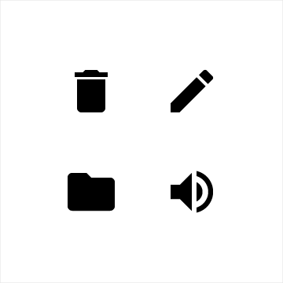   
   

### 上下文和应用中的图标

图标网格决定了图标位于一个固定大小(24dps)的区域内。

   
   

> 原文：[Icons](http://www.google.com/design/spec/style/icons.html) 翻译：[Haoxiqiang](https://github.com/haoxiqiang) 校对：[cxytomo](https://github.com/cxytomo)

  [1]: style_logos_product_intro_definition.png