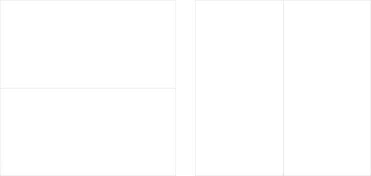
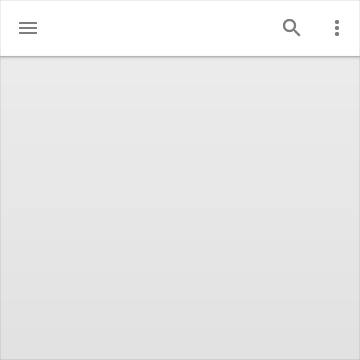
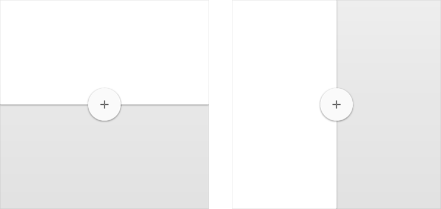
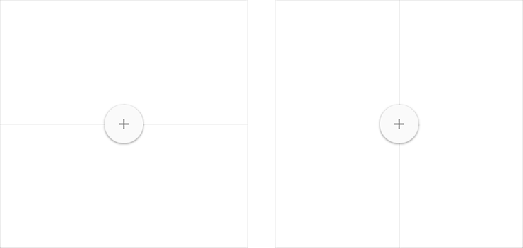

准则
===============

Material Design 使用的基本工具是来自大量的印刷设计，像基线网格和一组工作在各个页面的结构网格。布局设计能够按比例横跨不同尺寸的屏幕，促进UI开发和从根本上帮助你做可扩展的apps。

布局指南也能让app支持一致的外观和感觉，通过相同的视觉元素，结构网格，和常规的间隙规则来横跨不同平台与屏幕尺寸。结构和视觉上的一致创造了一个可识别的跨平台产品的用户环境，它给用户提供高层次的熟悉感和舒适，让产品更便于使用。

在深入的研究布局细节之前，再一次细想什么是Material Design：一种基于页面的品质设计。了解页面的行为和如何制作是很重要的。

## 页面制作

**在Material Design里，每一个像素点都是由应用程序在一个页面上画出来的**。页面有一个平滑背景颜色并可以作用于各种目的。一个典型的布局就是由多层页面组成的。

系统可能会为很多元素绘制像素，比如状态或者系统栏，但这些都不属于页面。想象那些被贴在显示器背面玻璃上的系统要素和那些独立于app内容的表面是很有帮助的。

**布置页面**

两个页面共用相同长度的一边就会产生叠合线。加入了叠合线的两张纸通常会一起移动。

两张纸在不同的Z轴位置重叠就会产生层阶[step]，因此通常是彼此独立移动。

**页面工具栏**

**工具栏**是一个专注于展示操作的页面。这些操作通常聚集在工具栏的左边缘和右边缘。与导航相关联的操作（一个抽屉菜单[ drawer menu ] ，一个向上的箭头[ up arrow ]）呈现在左边，然而适用于当前上下文的操作呈现在右边。

在工具栏左边和右边的操作不会被另一个页面分离。然而，工具栏可以强制它的宽度小于页面的全长。

限制宽度要小于整个页面的长度。

绝对不允许一个页面被另一个页面分离。

工具栏经常的在另一个页面上形成一个叠层用来显示与工具栏操作相关的内容。当页面滚动到工
具栏的底部，工具栏围绕在页面的入口点，防止它通过相反的一面。

工具栏也可以与第二个页面结合作为最初的显示，但是推起来之后就形成一个层阶[step]。这种极好的转换称为**瀑布**。

交替地，这个工具栏可以保持它本身的叠合线，当两个页面一起移动的时候就**推离**出屏幕。

最后，当它移动的时候第二个页面可以覆盖这个工具栏。

工具栏有一个标准的高度，但其实可以更高。当更高的时候，这个操作可以压住工具栏的最顶端或最低端。

一旦它被压住，工具栏可以动态改变高度。当改变尺寸的时候，他们会在最大和最小（标准）的高度之间调整（界定阈值）。

**浮动操作**

浮动操作是一个与工具栏分离的圆形页面。

浮动操作代表对上下文单一的提升操作。它可以跨越一个叠层，如果它与产生这个层阶[step]的页面内容相关联。

浮动操作可以跨越一个叠合线，如果它与产生这个叠合线的两个页面内容相关联。

永远不要引用一个装饰性的叠合线仅仅为了给操作提供一个支撑点。

***
